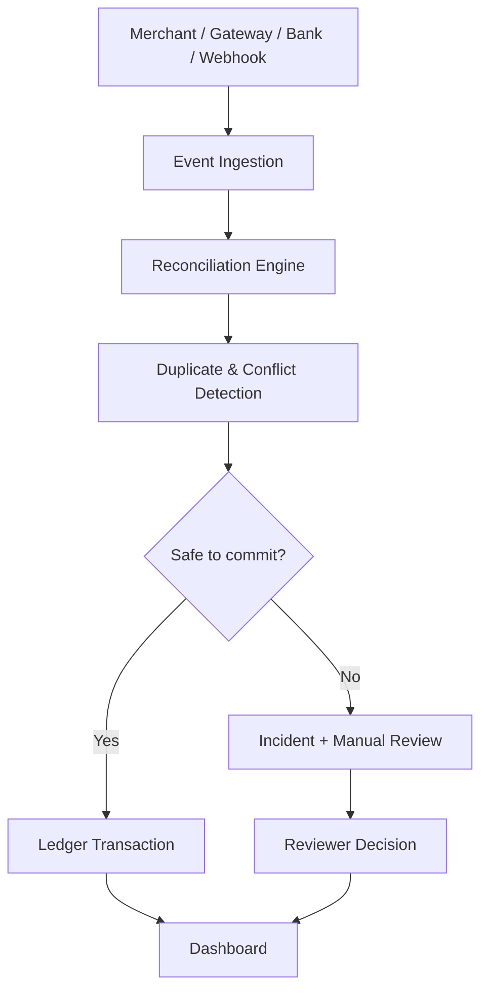

<div align="center">

# VERITY

### Payment-Truth & Financial-Failure Intelligence Engine

Verity reconciles conflicting payment observations from merchant, gateway, bank and webhook systems and decides what is **safe to commit to the ledger**. When evidence is ambiguous, it sends the case to manual review instead of guessing.


[Problem](#the-problem) · [Guarantees](#guarantees) · [Architecture](#architecture) · [Quick Start](#quick-start) · [API](#api) · [Testing](#testing)

</div>

---

## The Problem

A gateway times out, the merchant retries, and now the bank shows two successes while the webhook is still delayed.

```
Attempt 1 → Gateway timeout
Attempt 2 → Gateway SUCCESS · Bank SUCCESS · Webhook DELAYED
```

Verity sees **₹4,000** of exposure but can only attribute **₹2,000** to a legitimate payment intent. Booking ₹4,000 would be wrong, so Verity treats uncertainty as a first-class state and commits nothing until it is safe.

> Observed payment activity is not automatically financial truth.

## Guarantees

| ID | Guarantee |
|---|---|
| I1 | **Idempotency:** replaying duplicate events has no extra financial effect |
| I2 | **Determinism:** `generate(scenario, seed)` always produces the same events |
| I3 / I7 | **Safe ambiguity:** `POTENTIAL_DUPLICATE`, `CONFLICTING_STATE`, `INSUFFICIENT_EVIDENCE`, `MANUAL_REVIEW` never auto-create a transaction |
| I4 | **One transaction per intent:** enforced by a DB uniqueness constraint on `intent_id` |
| I5 | **Immutable events:** observations are append-only |
| I8 / I9 | **Single ledger write path:** transactions are created only through one authorized route |

`MANUAL_REVIEW` is a successful safety outcome, not a failure.

## Architecture



Events are stored immutably, grouped by payment intent and attempt, and compared across providers. Only a safe interpretation reaches the ledger.

## Tech Stack

| Layer | Technology |
|---|---|
| Backend | FastAPI, Python 3.12, SQLAlchemy, Alembic, Pydantic |
| Frontend | Next.js 14, React 18, TypeScript, Tailwind CSS, TanStack Query |
| Database | PostgreSQL |
| Testing | Pytest, Hypothesis |
| Infra | Docker Compose |

## Project Structure

```
Verity/
├── app/          # FastAPI backend
├── src/          # Next.js frontend
├── tests/        # Unit, API and property-based tests
├── migrations/   # Alembic migrations
├── scripts/      # Helper scripts
├── docker-compose.yml
├── .env.example
└── ASSUMPTIONS.md
```

## Quick Start

**Requirements:** Docker and Docker Compose. (Without Docker: Python 3.12+, Node.js 18+, PostgreSQL.)

```bash
git clone https://github.com/AlphaStorm-X/Verity.git
cd Verity
cp .env.example .env
docker-compose up --build
```

| Service | URL |
|---|---|
| Frontend | http://localhost:3000 |
| Backend | http://localhost:8000 |
| API docs | http://localhost:8000/docs |

**Without Docker**

```bash
# backend
pip install -r requirements.txt
alembic upgrade head
python -m uvicorn app.main:app --reload --port 8000

# frontend
npm install
npm run dev
```

## Configuration

| Variable | Purpose | Required |
|---|---|---|
| `DATABASE_URL` | PostgreSQL connection string | Yes |

## Demo: Canonical Scenario

```bash
curl -X POST "http://localhost:8000/api/simulations/CANONICAL_DEMO/run?seed=42"
```

| Metric | Result |
|---|---|
| Observed exposure | ₹4,000 |
| Candidate legitimate amount | ₹2,000 |
| Committed to ledger | ₹0 |
| State | `POTENTIAL_DUPLICATE` / `MANUAL_REVIEW` |

Then open http://localhost:3000, inspect the timeline and incident, and submit a review decision (`CONFIRM_ATTEMPT` or `MARK_DUPLICATE`).

## API

| Method | Endpoint | Purpose |
|---|---|---|
| GET | `/health` | Health check |
| POST | `/api/events` | Ingest a payment observation |
| GET | `/api/events` | List events |
| GET | `/api/transactions` | List transactions |
| GET | `/api/transactions/:id` | Transaction details |
| GET | `/api/transactions/:id/timeline` | Event timeline |
| GET | `/api/transactions/:id/analysis` | Reconciliation analysis |
| POST | `/api/transactions/:id/explain` | Generate explanation |
| GET | `/api/incidents` | List incidents |
| GET | `/api/incidents/:id` | Incident details |
| POST | `/api/incidents/:id/review` | Review an incident |
| POST | `/api/simulations` | Create simulation |
| POST | `/api/simulations/:id/run` | Run simulation |
| GET | `/api/dashboard` | Dashboard metrics |

## Testing

```bash
pytest      # backend, incl. Hypothesis property-based tests
npm test    # frontend
```

Property-based tests check invariants such as *duplicate replay → no additional financial effect* and *ambiguous state → no automatic ledger transaction*.

## Limitations

Demonstration system, not a production payment processor. No compliance claims are made. Not yet implemented: authentication, real provider integrations, streaming ingestion at scale, production observability.

## Contributing

Fork → clone → branch → install dependencies → `pytest && npm test` → make changes → run tests again → open a PR. Changes to the ledger write path must preserve the guarantees above.

## License

No license has currently been specified.

## Author

[AlphaStorm-X](https://github.com/AlphaStorm-X)POTENTIAL_DUPLICATE` / `MANUAL_REVIEW`
